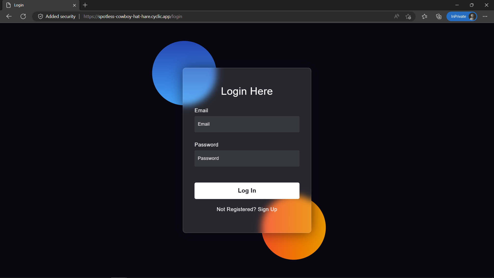
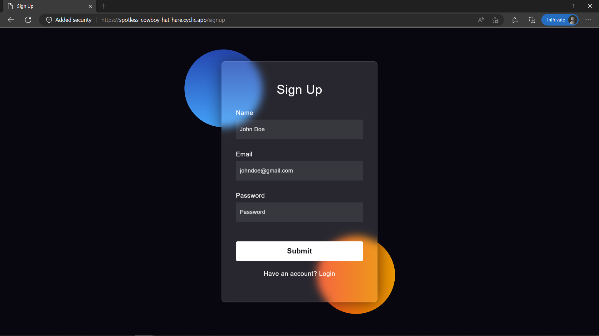
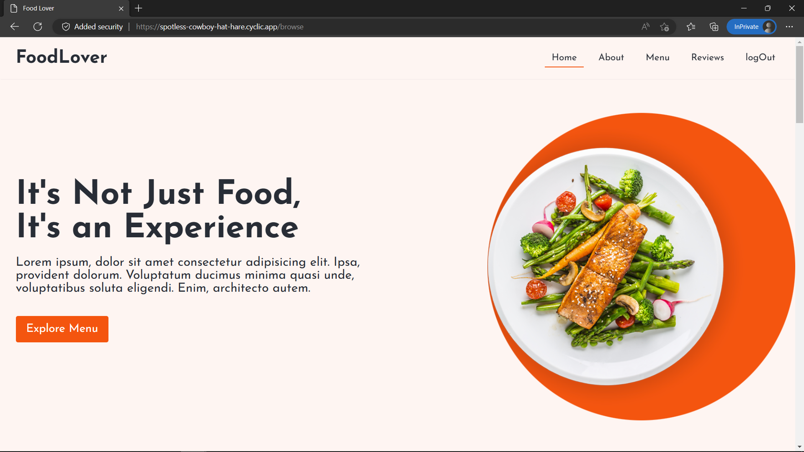

# Resto.Serve

Resto.Serve is a small static website made with NodeJS and ExpressJS.

ExpressJS is used for backend and static serving and SupaBase is used 
as an alternative for Firebase database.


---

## Installation

Install and run Resto website on your local machine with npm.

- ### Git Clone
```bash
  git clone https://github.com/jaysheel-ops/restaurant-website.git
```

- ### Install Dependency
```bash
  cd resto-serve
  npm install
```

- ### Add API Keys to your project
  To run this project, you will need to add the following environment variables to your .env file
  1. Create a .env file in your root folder
  2. Signup/Login to supabase and create a database 
  3. Create a "users" table in your project
  4. Go to Project Settings -> API
  5. Copy Project URL and Project API service role key in your ".env" file


`
  SUPABASE_KEY=YOUR_SERVICE_ROLE_API_KEY
`

`
  SUPABASE_URL=YOUR_PROJECT_URL
`

- ### Change PORT 3000 to your custom PORT 
    Eventually you can also change the default port 3000 to any other port that your express server should run on.

    Just set the PORT variable in ".env" file to your desired port number.

`
  PORT=YOUR_PORT
`

- ### Launch without Hot Reload
```bash
  node index.js
```
  

- ### Launch with Hot Reload Server
    With Hot Reload your Express server will reload automatically after every save. This saves your time by stopping and running the server automatically.

```bash
  nodemon index.js
```

---

## Screenshots







---

## Appendix

Frontend - HTML/CSS

Backend - ExpressJS

Database - SupaBase

---

## Authors

- [@jaysheel-ops](https://www.github.com/jaysheel-ops)

---

## Acknowledgements

 - [SupaBase API Documentation](https://supabase.com/docs/guides/api)
 - [Express Documentation](https://github.com/matiassingers/awesome-readme)
 - [Cyclic.sh](https://cyclic.sh)
